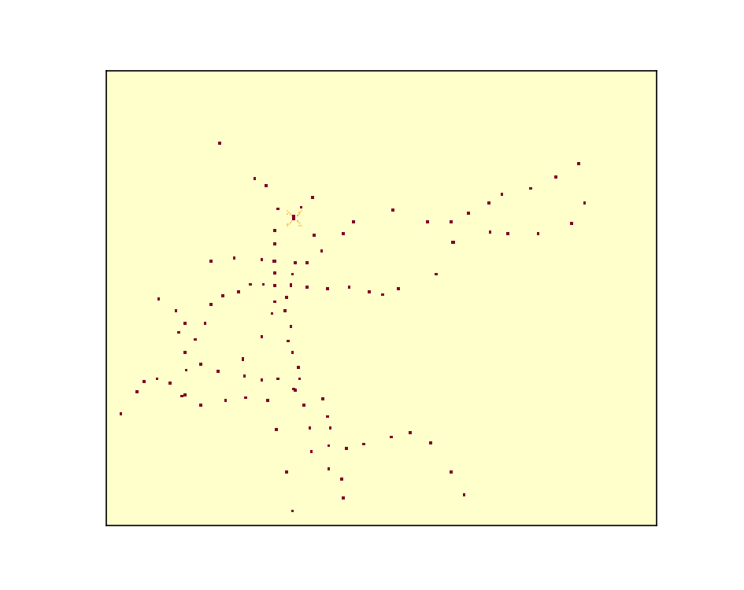
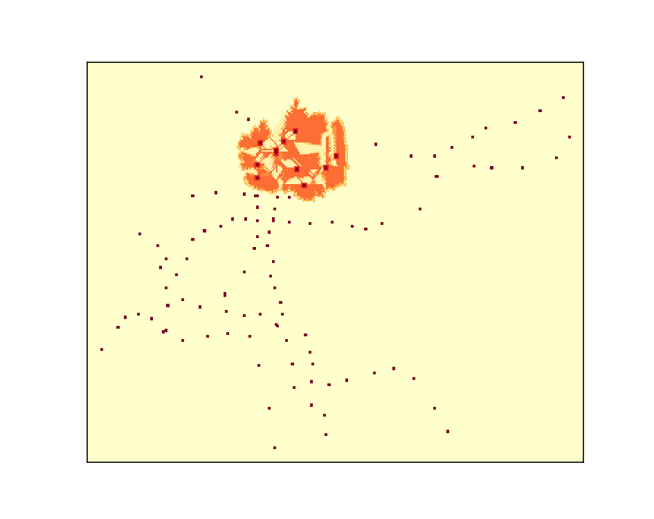
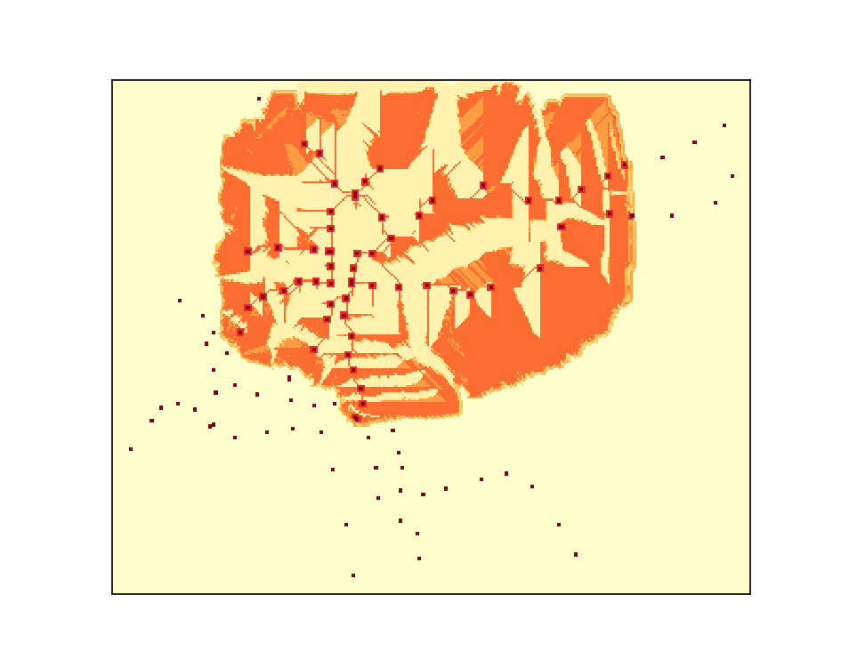
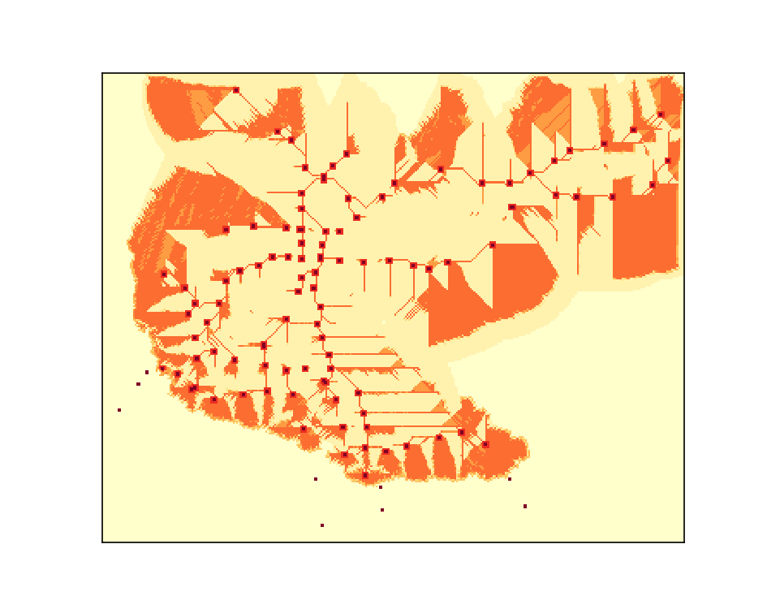
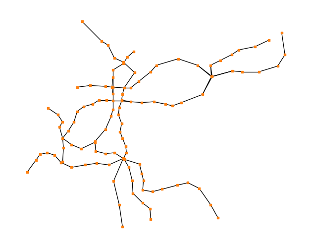
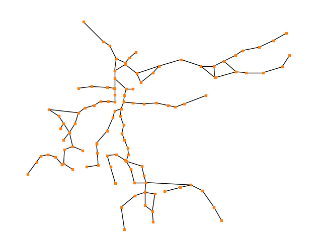

## Setup this project

1. Installing [conda](https://conda.io/projects/conda/en/latest/user-guide/install/index.html)
2. Creating conda environment
    - `conda env create -f environment.yml`
3. Activating the environment
    - `conda activate slime`
4. Updating the environment
    - `conda env update --name slime --file environment.yml --prune`

## Example output animations

   
  

  
  

## Network comparison

## Background

Slime mould, Physarum polycephalum, works like this: Single-celled organisms grow when fed, creating a network of nutrient-channeling tubes. Nature and evolution have spent millennia perfecting this living complex system, which, if given enough time, will optimise its network structure to transfer nutrients efficiently throughout the entire organism. This is done in two stages: first forage for food sources by growing outward, then adaptively refine the network and respond to the environment by killing off inefficient branches. 

When slime mould is put to work it can do amazing things like solve mazes, change its structure to account for changes in resources and display something akin to memory. 

Slime mould grows at approximately 1-4cm an hour (if conditions are good and depending on, which source you trust), and will successfully map most problems in a few days. 
 
In 2010 a team of researchers arranged pieces of oatmeal on a petri dish to represent railway stations of Tokyo. 
 - The slime evolved to produce a network that looked a lot like Tokyo’s actual railway network! (Slime mould loves oatmeal and hates salt). 
 - The slime mould doesn’t have any awareness of the overall problem it is trying to solve. 
 - An emergent phenomenon, 
 - micro behaviour creating macro patterns, 
 - feedback loops, 
 - local interaction 
 - as the driver and creator of a superorganisms’ communication network, 
 - and many of the other themes

## Physarum

- large, single-celled amoeboid organism
- forage for patchily distributed food sources
- initially explores with a relatively contiguous foraging margin - maximize the area searched
- linking the discovered food sources through
   - direct connections, or
   - additional intermediate junctions (reduce the overall length of the connecting network)
   - formation of occasional cross-links (improve overall transport efficiency and resilience)
- Growing is influence by
   - characteristics of the substrate
   - physical barriers (constraint)
   - light regime
- find the shortest path through
   - a maze
   - connect different arrays of food sources in an efficient manner with
      - low total length (TL)
      - short average minimum distance (MD) between pairs of food sources (FSs)
      - high degree of fault tolerance (FT) to accidental disconnection
- Once these have been located, the many branches it has sent out die back,
- leaving only the most efficient route between food source nodes.
- slime has mapped the optimum transport networks of numerous cities, as well as the Silk Road and a full global trade route.

## Tasks:
 - create a bio-inspired model of the slime in-silico and 
 - simulate its evolution over a ‘city’ of nutrient loaded ‘towns’ 
 - Optimising the resulting network. 
 

